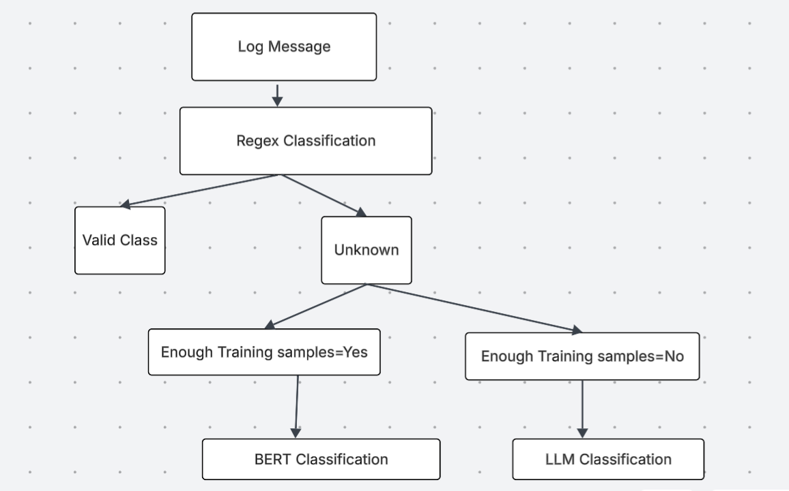

```markdown
# 🚀 Hybrid Log Classification 

This project implements a **hybrid log classification system**, combining rule-based, machine learning, and large language model (LLM) approaches to handle a wide range of log message complexities.  


Architecture Diagram


---

## 🔎 Classification Approaches

1. **Regex-based Classification**  
   - Best for simple and predictable patterns.  
   - Fast and lightweight using predefined rules.  

2. **Sentence Transformer + Logistic Regression**  
   - Handles moderately complex patterns when enough labeled data is available.  
   - Uses **embeddings** from `SentenceTransformers` and applies **Logistic Regression** for classification.  

3. **LLM-based Classification**   
   - Useful when labeled training data is insufficient.  

---

## 📂 Project Structure

```

project-root/

│── training/         # Training code (Regex + Sentence Transformer + Logistic Regression)

│── models/           # Saved models (embeddings, classifiers)

│── resources/        # Resource files (sample CSVs, outputs, images, etc.)

│── server.py         # FastAPI server for inference

│── requirements.txt  # Dependencies

│── README.md         # Project documentation

````

---

## ⚙️ Setup Instructions

1. **Install Dependencies**  
   Ensure Python is installed, then run:  
   ```bash
   pip install -r requirements.txt
````

2. **Run the FastAPI Server**

   Access the API at:

   * [http://127.0.0.1:8000/](http://127.0.0.1:8000/)

---

## 📌 Usage

Upload a CSV file with the following columns:

* `source`
* `log_message`

The output will be a CSV with an added column:

* `target_label` → the predicted class for each log entry.

---

**Tools**

Sentence Transformer:

Sentence Transformers are models that convert sentences or text into dense vector embeddings so that semantically similar sentences are close in vector space. They are widely used for semantic search, clustering, and similarity tasks.

Logistic Regression is a statistical model used to predict the probability of a binary outcome (e.g., yes/no) based on one or more input features.

LLM:
LLaMA is a family of large language models by Meta designed for efficient natural language understanding and generation.

Groq provides an interface to run large language models (LLMs) through their API.
It’s used here to send prompts and get model-generated completions.

LLaMA-based Model
deepseek-r1-distill-llama-70b is a large language model optimized for text understanding and generation. It processes the log message and outputs the predicted category.

joblib is a Python library used for efficient serialization (saving) and parallel processing.
Serialization: Saves Python objects (like trained machine learning models, large arrays) to disk and loads them back quickly. It’s faster and more efficient for large NumPy arrays. joblib = fast saving/loading + parallel processing.

import joblib
joblib.dump(model, 'model.pkl')  # Save
model = joblib.load('model.pkl')  # Load

joblib is used for model persistence, efficient storage of large data, parallel processing, caching, and compression.

**Flow:**

1. Logs enter the system.
2. Regex handles simple cases.
3. If not matched, embeddings + ML model are used.
4. For edge/unseen cases, LLM provides classification.
5. Final results are exported with labels.

---
